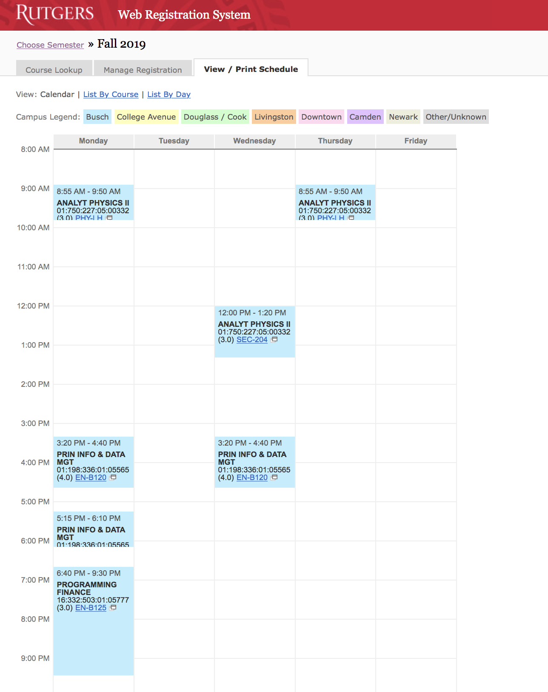
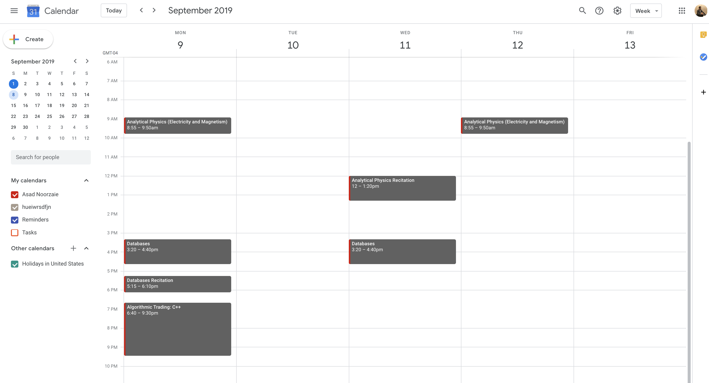

# Rutgers University: Automated Class Scheduler

Worry no more Rutgers students! No more do you have to manually enter each and every individual class from WebReg to your Google Calendar.

I have created a command line interface (CLI) tool that enables Rutgers students to automatically schedule their classes from WebReg onto Google Calendar with the simplicity of running a script.

By running the script, you'll be able to migrate all your classes from Webreg to your Google Calendar without manually configuring each and every class of yours!

Here's an example of what running the script will do:

Your WebReg Page:

After running the script, your Google Calendar is updated:

More info coming soon...
